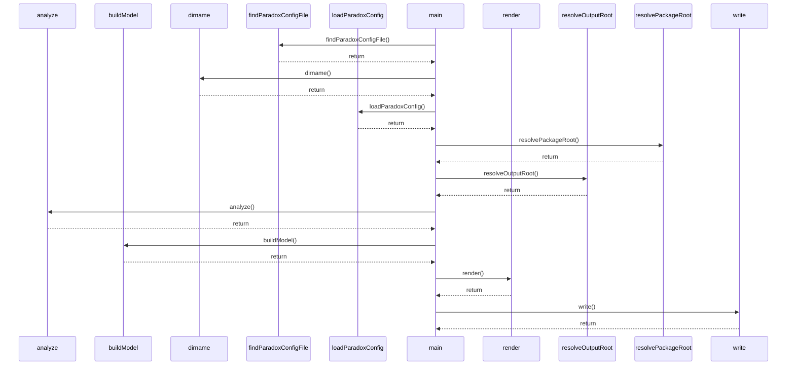

<!-- markdownlint-disable MD013 MD033 -->
<!-- This file is generated by Paradox. Do not edit manually. -->

# @ankhorage/paradox

        

Deterministic documentation generator for TypeScript packages.

## Installation

```bash
bunx @ankhorage/paradox
```

## CLI

<details>
<summary>paradox</summary>

Runs the Paradox CLI.

The command discovers the nearest Paradox config, resolves the package and output roots,
analyzes the package, builds the documentation model, renders all documentation artifacts,
and writes them to the configured output directory.

```bash
bunx @ankhorage/paradox
```

Diagram: [paradox sequence](./paradox/diagrams/sequences/paradox.mmd)



</details>

## Configuration

Create a `paradox.config.ts` file:

```ts
import { defineParadoxConfig } from '@ankhorage/paradox';

export default defineParadoxConfig({
  // ...
});
```

<details>
<summary>Configuration options</summary>

| Field   | Type                                                                                          | Required | Default | Description |
| ------- | --------------------------------------------------------------------------------------------- | -------- | ------- | ----------- |
| mode    | `'safe' \| 'write' \| undefined`                                                              | no       | —       |             |
| docs    | `{ title?: string; description?: string; usage?: { entrypoints?: string[]; }; } \| undefined` | no       | —       |             |
| package | `{ root?: string; entrypoints?: string[]; } \| undefined`                                     | no       | —       |             |
| output  | `{ dir?: string; } \| undefined`                                                              | no       | —       |             |

</details>

## Generated documentation

- [Interactive documentation app](./paradox/index.html)
- [Public API reference](./paradox/exports.md)
- [Component registry](./paradox/components.md)
- [Architecture overview](./paradox/diagrams/architecture-overview.mmd)
- [Module relationships](./paradox/diagrams/module-relationships.mmd)
- [Export graph](./paradox/diagrams/export-graph.mmd)
- [isParadoxDocTagName sequence](./paradox/diagrams/sequences/is-paradox-doc-tag-name.mmd)
- [paradox sequence](./paradox/diagrams/sequences/paradox.mmd)

## Public API

### Config

<details>
<summary>defineParadoxConfig</summary>

```ts
defineParadoxConfig(config: ParadoxConfig) => ParadoxConfig
```

Defines a Paradox configuration object without changing its shape.

Module: `src/config/defineParadoxConfig.ts`
Source: `src/config/defineParadoxConfig.ts:8:1`
Related symbols: `ParadoxConfig`

</details>

<details>
<summary>ParadoxConfig</summary>

Configuration for running Paradox.

Module: `src/config/types.ts`
Source: `src/config/types.ts:7:1`

</details>
