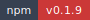
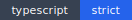
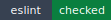
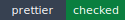
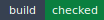
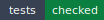
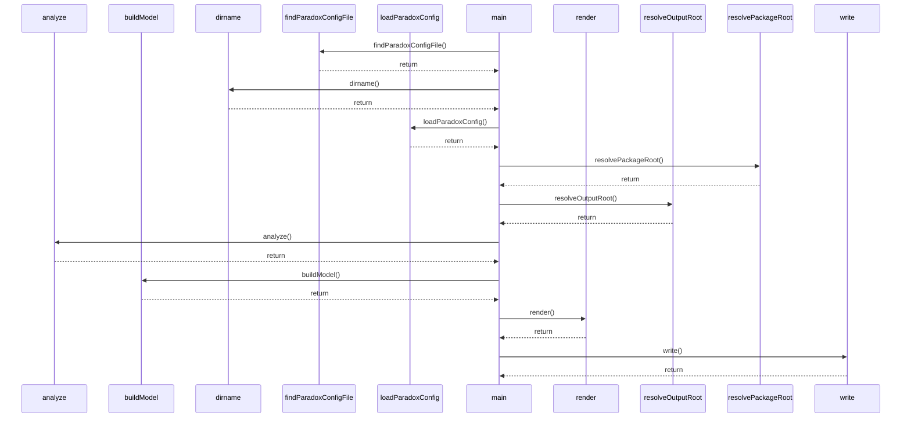

<!-- markdownlint-disable MD013 MD033 -->
<!-- This file is generated by Paradox. Do not edit manually. -->

# @ankhorage/paradox

        

Deterministic documentation generator for TypeScript packages.

## Installation

```bash
bunx @ankhorage/paradox
```

## CLI

<details>
<summary>paradox</summary>

Runs the Paradox CLI.

The command discovers the nearest Paradox config, resolves the package and output roots,
analyzes the package, builds the documentation model, renders all documentation artifacts,
and writes them to the configured output directory.

```bash
bunx @ankhorage/paradox
```

Diagram: [paradox sequence](./paradox/diagrams/sequences/paradox.mmd)



</details>

## Configuration

Create a `paradox.config.ts` file:

```ts
import { defineParadoxConfig } from '@ankhorage/paradox';

export default defineParadoxConfig({
  // ...
});
```

<details>
<summary>Configuration options</summary>

| Field   | Type                                                      | Required | Default | Description |
| ------- | --------------------------------------------------------- | -------- | ------- | ----------- |
| mode    | `'safe' \| 'write' \| undefined`                          | no       | —       |             |
| docs    | `{ title?: string; description?: string; } \| undefined`  | no       | —       |             |
| package | `{ root?: string; entrypoints?: string[]; } \| undefined` | no       | —       |             |
| output  | `{ dir?: string; } \| undefined`                          | no       | —       |             |

</details>

## Generated documentation

- [Interactive documentation app](./paradox/index.html)
- [Public API reference](./paradox/exports.md)
- [Component registry](./paradox/components.md)
- [Architecture overview](./paradox/diagrams/architecture-overview.mmd)
- [Module relationships](./paradox/diagrams/module-relationships.mmd)
- [Export graph](./paradox/diagrams/export-graph.mmd)
- [isParadoxDocTagName sequence](./paradox/diagrams/sequences/is-paradox-doc-tag-name.mmd)
- [paradox sequence](./paradox/diagrams/sequences/paradox.mmd)

## Architecture preview

```mermaid
graph TD
  package__ankhorage_paradox["@ankhorage/paradox"]
  entrypoint_src_index_ts["src/index.ts"]
  package__ankhorage_paradox --> entrypoint_src_index_ts
  module_src_analyze_analyze_ts["src/analyze/analyze.ts"]
  package__ankhorage_paradox -.-> module_src_analyze_analyze_ts
  module_src_analyze_analyze_ts --> module_src_analyze_badges_ts
  module_src_analyze_analyze_ts --> module_src_analyze_components_ts
  module_src_analyze_analyze_ts --> module_src_analyze_exports_ts
  module_src_analyze_analyze_ts --> module_src_analyze_modules_ts
  module_src_analyze_analyze_ts --> module_src_analyze_project_ts
  module_src_analyze_analyze_ts --> module_src_analyze_semantic_createTypeScriptProgram_ts
  module_src_analyze_analyze_ts --> module_src_analyze_semantic_exports_ts
  module_src_analyze_analyze_ts --> module_src_analyze_semantic_graphs_ts
  module_src_analyze_analyze_ts --> module_src_analyze_sequenceScenarios_ts
  module_src_analyze_analyze_ts --> module_src_analyze_sourceFunctions_ts
  module_src_analyze_analyze_ts --> module_src_analyze_types_ts
  module_src_analyze_analyze_ts --> module_src_analyze_usage_ts
  module_src_analyze_analyze_ts --> module_src_config_types_ts
  module_src_analyze_badges_ts["src/analyze/badges.ts"]
  package__ankhorage_paradox -.-> module_src_analyze_badges_ts
  module_src_analyze_badges_ts --> module_src_analyze_types_ts
  module_src_analyze_badges_ts --> module_src_analyze_usage_ts
  module_src_analyze_components_ts["src/analyze/components.ts"]
  package__ankhorage_paradox -.-> module_src_analyze_components_ts
  module_src_analyze_components_ts --> module_src_analyze_semantic_exports_ts
  module_src_analyze_components_ts --> module_src_analyze_semantic_model_ts
  module_src_analyze_components_ts --> module_src_analyze_types_ts
  module_src_analyze_components_ts --> module_src_analyze_utils_getComponentPropsType_ts
  module_src_analyze_components_ts --> module_src_analyze_utils_getPropsFromType_ts
  module_src_analyze_components_ts --> module_src_analyze_utils_isReactComponent_ts
  module_src_analyze_exports_ts["src/analyze/exports.ts"]
  package__ankhorage_paradox -.-> module_src_analyze_exports_ts
  module_src_analyze_exports_ts --> module_src_analyze_types_ts
  module_src_analyze_exports_ts --> module_src_analyze_utils_getExportMetadata_ts
  module_src_analyze_exports_ts --> module_src_analyze_utils_getParadoxComment_ts
  module_src_analyze_exports_ts --> module_src_analyze_utils_parseParadoxComment_ts
  module_src_analyze_exports_ts --> module_src_analyze_utils_resolveExportSymbol_ts
  module_src_analyze_modules_ts["src/analyze/modules.ts"]
  package__ankhorage_paradox -.-> module_src_analyze_modules_ts
  module_src_analyze_modules_ts --> module_src_analyze_types_ts
  module_src_analyze_project_ts["src/analyze/project.ts"]
  package__ankhorage_paradox -.-> module_src_analyze_project_ts
  module_src_analyze_semantic_analyzeProject_ts["src/analyze/semantic/analyzeProject.ts"]
  package__ankhorage_paradox -.-> module_src_analyze_semantic_analyzeProject_ts
  module_src_analyze_semantic_analyzeProject_ts --> module_src_analyze_semantic_associateDocBlocksWithSymbols_ts
  module_src_analyze_semantic_analyzeProject_ts --> module_src_analyze_semantic_collectSourceFiles_ts
  module_src_analyze_semantic_analyzeProject_ts --> module_src_analyze_semantic_createTypeScriptProgram_ts
  module_src_analyze_semantic_analyzeProject_ts --> module_src_analyze_semantic_docBlocks_ts
  module_src_analyze_semantic_analyzeProject_ts --> module_src_analyze_semantic_exports_ts
  module_src_analyze_semantic_analyzeProject_ts --> module_src_analyze_semantic_graphs_ts
  module_src_analyze_semantic_analyzeProject_ts --> module_src_analyze_semantic_model_ts
  module_src_analyze_semantic_analyzeProject_ts --> module_src_analyze_semantic_tagRegistry_ts
  module_src_analyze_semantic_associateDocBlocksWithSymbols_ts["src/analyze/semantic/associateDocBlocksWithSymbols.ts"]
  package__ankhorage_paradox -.-> module_src_analyze_semantic_associateDocBlocksWithSymbols_ts
  module_src_analyze_semantic_associateDocBlocksWithSymbols_ts --> module_src_analyze_semantic_model_ts
  module_src_analyze_semantic_associateDocBlocksWithSymbols_ts --> module_src_analyze_semantic_utils_ts
  module_src_analyze_semantic_collectSourceFiles_ts["src/analyze/semantic/collectSourceFiles.ts"]
  package__ankhorage_paradox -.-> module_src_analyze_semantic_collectSourceFiles_ts
  module_src_analyze_semantic_collectSourceFiles_ts --> module_src_analyze_semantic_model_ts
  module_src_analyze_semantic_collectSourceFiles_ts --> module_src_analyze_semantic_utils_ts
  module_src_analyze_semantic_createTypeScriptProgram_ts["src/analyze/semantic/createTypeScriptProgram.ts"]
  package__ankhorage_paradox -.-> module_src_analyze_semantic_createTypeScriptProgram_ts
  module_src_analyze_semantic_createTypeScriptProgram_ts --> module_src_analyze_semantic_model_ts
  module_src_analyze_semantic_createTypeScriptProgram_ts --> module_src_analyze_semantic_utils_ts
  module_src_analyze_semantic_docBlocks_ts["src/analyze/semantic/docBlocks.ts"]
  package__ankhorage_paradox -.-> module_src_analyze_semantic_docBlocks_ts
  module_src_analyze_semantic_docBlocks_ts --> module_src_analyze_semantic_model_ts
  module_src_analyze_semantic_docBlocks_ts --> module_src_analyze_semantic_tagRegistry_ts
  module_src_analyze_semantic_docBlocks_ts --> module_src_analyze_semantic_utils_ts
  module_src_analyze_semantic_exports_ts["src/analyze/semantic/exports.ts"]
  package__ankhorage_paradox -.-> module_src_analyze_semantic_exports_ts
  module_src_analyze_semantic_exports_ts --> module_src_analyze_semantic_isReactComponent_ts
  module_src_analyze_semantic_exports_ts --> module_src_analyze_semantic_model_ts
  module_src_analyze_semantic_exports_ts --> module_src_analyze_semantic_paradoxComment_ts
  module_src_analyze_semantic_exports_ts --> module_src_analyze_semantic_utils_ts
  module_src_analyze_semantic_graphs_ts["src/analyze/semantic/graphs.ts"]
  package__ankhorage_paradox -.-> module_src_analyze_semantic_graphs_ts
  module_src_analyze_semantic_graphs_ts --> module_src_analyze_semantic_exports_ts
  module_src_analyze_semantic_graphs_ts --> module_src_analyze_semantic_model_ts
  module_src_analyze_semantic_graphs_ts --> module_src_analyze_semantic_utils_ts
  module_src_analyze_semantic_isReactComponent_ts["src/analyze/semantic/isReactComponent.ts"]
  package__ankhorage_paradox -.-> module_src_analyze_semantic_isReactComponent_ts
  module_src_analyze_semantic_model_ts["src/analyze/semantic/model.ts"]
  package__ankhorage_paradox -.-> module_src_analyze_semantic_model_ts
  module_src_analyze_semantic_paradoxComment_ts["src/analyze/semantic/paradoxComment.ts"]
  package__ankhorage_paradox -.-> module_src_analyze_semantic_paradoxComment_ts
  module_src_analyze_semantic_tagRegistry_ts["src/analyze/semantic/tagRegistry.ts"]
  package__ankhorage_paradox -.-> module_src_analyze_semantic_tagRegistry_ts
  module_src_analyze_semantic_utils_ts["src/analyze/semantic/utils.ts"]
  package__ankhorage_paradox -.-> module_src_analyze_semantic_utils_ts
  module_src_analyze_sequenceScenarios_ts["src/analyze/sequenceScenarios.ts"]
  package__ankhorage_paradox -.-> module_src_analyze_sequenceScenarios_ts
  module_src_analyze_sequenceScenarios_ts --> module_src_analyze_semantic_utils_ts
  module_src_analyze_sequenceScenarios_ts --> module_src_analyze_types_ts
  module_src_analyze_sequenceScenarios_ts --> module_src_analyze_usage_ts
  module_src_analyze_sequenceScenarios_ts --> module_src_analyze_utils_getParadoxComment_ts
  module_src_analyze_sequenceScenarios_ts --> module_src_analyze_utils_parseParadoxComment_ts
  module_src_analyze_sourceFunctions_ts["src/analyze/sourceFunctions.ts"]
  package__ankhorage_paradox -.-> module_src_analyze_sourceFunctions_ts
  module_src_analyze_sourceFunctions_ts --> module_src_analyze_types_ts
  module_src_analyze_sourceFunctions_ts --> module_src_analyze_utils_getParadoxComment_ts
  module_src_analyze_sourceFunctions_ts --> module_src_analyze_utils_parseParadoxComment_ts
  module_src_analyze_types_ts["src/analyze/types.ts"]
  package__ankhorage_paradox -.-> module_src_analyze_types_ts
  module_src_analyze_usage_ts["src/analyze/usage.ts"]
  package__ankhorage_paradox -.-> module_src_analyze_usage_ts
  module_src_analyze_usage_ts --> module_src_analyze_types_ts
  module_src_analyze_utils_getComponentPropsType_ts["src/analyze/utils/getComponentPropsType.ts"]
  package__ankhorage_paradox -.-> module_src_analyze_utils_getComponentPropsType_ts
  module_src_analyze_utils_getExportMetadata_ts["src/analyze/utils/getExportMetadata.ts"]
  package__ankhorage_paradox -.-> module_src_analyze_utils_getExportMetadata_ts
  module_src_analyze_utils_getExportMetadata_ts --> module_src_analyze_types_ts
  module_src_analyze_utils_getExportMetadata_ts --> module_src_analyze_utils_getParadoxComment_ts
  module_src_analyze_utils_getExportMetadata_ts --> module_src_analyze_utils_parseParadoxComment_ts
  module_src_analyze_utils_getParadoxComment_ts["src/analyze/utils/getParadoxComment.ts"]
  package__ankhorage_paradox -.-> module_src_analyze_utils_getParadoxComment_ts
  module_src_analyze_utils_getPropsFromType_ts["src/analyze/utils/getPropsFromType.ts"]
  package__ankhorage_paradox -.-> module_src_analyze_utils_getPropsFromType_ts
  module_src_analyze_utils_getPropsFromType_ts --> module_src_analyze_types_ts
  module_src_analyze_utils_getPropsFromType_ts --> module_src_analyze_utils_getParadoxComment_ts
  module_src_analyze_utils_getPropsFromType_ts --> module_src_analyze_utils_parseParadoxComment_ts
  module_src_analyze_utils_isReactComponent_ts["src/analyze/utils/isReactComponent.ts"]
  package__ankhorage_paradox -.-> module_src_analyze_utils_isReactComponent_ts
  module_src_analyze_utils_parseParadoxComment_ts["src/analyze/utils/parseParadoxComment.ts"]
  package__ankhorage_paradox -.-> module_src_analyze_utils_parseParadoxComment_ts
  module_src_analyze_utils_resolveExportSymbol_ts["src/analyze/utils/resolveExportSymbol.ts"]
  package__ankhorage_paradox -.-> module_src_analyze_utils_resolveExportSymbol_ts
  module_src_cli_ts["src/cli.ts"]
  package__ankhorage_paradox -.-> module_src_cli_ts
  module_src_cli_ts --> module_src_analyze_analyze_ts
  module_src_cli_ts --> module_src_model_buildModel_ts
  module_src_cli_ts --> module_src_paths_policy_ts
  module_src_cli_ts --> module_src_render_render_ts
  module_src_cli_ts --> module_src_write_write_ts
  module_src_config_defineParadoxConfig_ts["src/config/defineParadoxConfig.ts"]
  package__ankhorage_paradox -.-> module_src_config_defineParadoxConfig_ts
  module_src_config_defineParadoxConfig_ts --> module_src_config_types_ts
  module_src_config_types_ts["src/config/types.ts"]
  package__ankhorage_paradox -.-> module_src_config_types_ts
  module_src_doc_tags_registry_ts["src/doc-tags/registry.ts"]
  package__ankhorage_paradox -.-> module_src_doc_tags_registry_ts
  module_src_index_ts["src/index.ts"]
  module_src_model_buildModel_ts["src/model/buildModel.ts"]
  package__ankhorage_paradox -.-> module_src_model_buildModel_ts
  module_src_model_buildModel_ts --> module_src_model_types_ts
  module_src_model_types_ts["src/model/types.ts"]
  package__ankhorage_paradox -.-> module_src_model_types_ts
  module_src_paths_policy_ts["src/paths/policy.ts"]
  package__ankhorage_paradox -.-> module_src_paths_policy_ts
  module_src_paths_policy_ts --> module_src_config_types_ts
  module_src_render_render_ts["src/render/render.ts"]
  package__ankhorage_paradox -.-> module_src_render_render_ts
  module_src_render_render_ts --> module_src_model_types_ts
  module_src_render_render_ts --> module_src_render_renderers_badges_ts
  module_src_render_render_ts --> module_src_render_renderers_diagrams_ts
  module_src_render_render_ts --> module_src_render_renderers_html_ts
  module_src_render_render_ts --> module_src_render_renderers_markdown_ts
  module_src_render_render_ts --> module_src_render_types_ts
  module_src_render_renderers_badges_ts["src/render/renderers/badges.ts"]
  package__ankhorage_paradox -.-> module_src_render_renderers_badges_ts
  module_src_render_renderers_badges_ts --> module_src_model_types_ts
  module_src_render_renderers_badges_ts --> module_src_render_types_ts
  module_src_render_renderers_diagrams_ts["src/render/renderers/diagrams.ts"]
  package__ankhorage_paradox -.-> module_src_render_renderers_diagrams_ts
  module_src_render_renderers_diagrams_ts --> module_src_model_types_ts
  module_src_render_renderers_diagrams_ts --> module_src_render_types_ts
  module_src_render_renderers_html_ts["src/render/renderers/html.ts"]
  package__ankhorage_paradox -.-> module_src_render_renderers_html_ts
  module_src_render_renderers_html_ts --> module_src_model_types_ts
  module_src_render_renderers_html_ts --> module_src_render_types_ts
  module_src_render_renderers_markdown_ts["src/render/renderers/markdown.ts"]
  package__ankhorage_paradox -.-> module_src_render_renderers_markdown_ts
  module_src_render_renderers_markdown_ts --> module_src_model_types_ts
  module_src_render_renderers_markdown_ts --> module_src_render_types_ts
  module_src_render_types_ts["src/render/types.ts"]
  package__ankhorage_paradox -.-> module_src_render_types_ts
  module_src_render_types_ts --> module_src_model_types_ts
  module_src_write_write_ts["src/write/write.ts"]
  package__ankhorage_paradox -.-> module_src_write_write_ts
  module_src_write_write_ts --> module_src_config_types_ts
  module_src_write_write_ts --> module_src_render_types_ts
```

<details>
<summary>Architecture overview</summary>



</details>

## Public API

### Config

<details>
<summary>defineParadoxConfig</summary>

```ts
defineParadoxConfig(config: ParadoxConfig) => ParadoxConfig
```

Defines a Paradox configuration object without changing its shape.

Module: `src/config/defineParadoxConfig.ts`
Source: `src/config/defineParadoxConfig.ts:8:1`
Related symbols: `ParadoxConfig`

</details>

<details>
<summary>ParadoxConfig</summary>

Configuration for running Paradox.

Module: `src/config/types.ts`
Source: `src/config/types.ts:7:1`

</details>

### Documentation

<details>
<summary>PARADOX_DOC_TAGS</summary>

Supported Paradox documentation tags.

Paradox supports doc tags inside triple-star documentation comments.

| name      | syntax     | description                                                                                                                                                      | applies to      | repeatable | handler        |
| --------- | ---------- | ---------------------------------------------------------------------------------------------------------------------------------------------------------------- | --------------- | ---------- | -------------- |
| `readme`  | `@readme`  | Includes a documentation block or exported symbol in README output.                                                                                              | block, symbol   | no         | `markReadme`   |
| `config`  | `@config`  | Marks a type or interface as part of the Paradox configuration model. @config alone does not imply README inclusion; use @config plus @readme for README output. | interface, type | no         | `markConfig`   |
| `example` | `@example` | Adds a titled fenced code example to the generated documentation for a symbol.                                                                                   | symbol          | yes        | `parseExample` |

Module: `src/doc-tags/registry.ts`
Source: `src/doc-tags/registry.ts:8:14`

</details>
