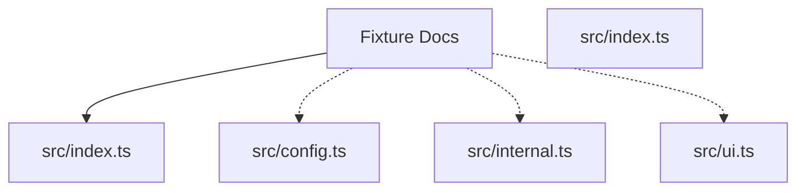

# Fixture Docs

 

Generated fixture docs.

## Usage

```bash
bunx @fixture/basic
```

## Configuration

Create a `basic.config.ts` file:

```ts
import type { ToolConfig } from '@fixture/basic';

const config = {
  // ...
} satisfies ToolConfig;

export default config;
```

### Configuration options

| Field | Type | Required | Default | Description |
| --- | --- | --- | --- | --- |
| enabled | `boolean` | yes |  |  |

## Generated documentation

- [Interactive documentation app](./paradox/index.html)
- [Public API reference](./paradox/exports.md)
- [Component registry](./paradox/components.md)
- [Architecture overview](./paradox/diagrams/architecture-overview.mmd)
- [Module relationships](./paradox/diagrams/module-relationships.mmd)
- [Export graph](./paradox/diagrams/export-graph.mmd)
- [Entrypoint sequence](./paradox/diagrams/entrypoint-sequence.mmd)

## Architecture preview



## Path resolution

- Config discovery: searches upward from `process.cwd()` for `paradox.config.ts/js/mjs/cjs` (required; no fallback).
- Package root: defaults to the directory containing `paradox.config.*`; `package.root` (when relative) resolves relative to that directory.
- Output directory: defaults to `paradox/`; `output.dir` (when relative) resolves relative to the resolved package root and must stay inside it.
- Modes:
  - `safe`: writes generated artifacts only under the output directory
  - `write`: additionally updates `<packageRoot>/README.md`

## Public API

### Button

Renders the fixture button component.

- Kind: `function`
- Module: `src/ui.ts`
- Source: `src/ui.ts:28:1`
- Export paths: `src/index.ts`
- Related symbols: `ButtonProps`

### ButtonProps

Props accepted by the fixture button.

- Kind: `type`
- Module: `src/ui.ts`
- Source: `src/ui.ts:10:1`
- Export paths: `src/index.ts`

### createButtonState

Builds button props from raw inputs.

- Kind: `function`
- Module: `src/ui.ts`
- Source: `src/ui.ts:41:1`
- Export paths: `src/index.ts`
- Related symbols: `ButtonProps`

### ToolConfig

Configuration for the fixture package.

- Kind: `type`
- Module: `src/config.ts`
- Source: `src/config.ts:6:1`
- Export paths: `src/index.ts`
