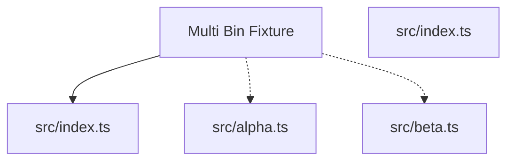

# Multi Bin Fixture

Fixture docs for multiple binaries.

## Usage

```bash
bunx fixture-multi-bin alpha
bunx fixture-multi-bin beta
```

## Generated documentation

- [Interactive documentation app](./paradox/index.html)
- [Public API reference](./paradox/exports.md)
- [Component registry](./paradox/components.md)
- [Architecture overview](./paradox/diagrams/architecture-overview.mmd)
- [Module relationships](./paradox/diagrams/module-relationships.mmd)
- [Export graph](./paradox/diagrams/export-graph.mmd)
- [Entrypoint sequence](./paradox/diagrams/entrypoint-sequence.mmd)

## Architecture preview



## Path resolution

- Config discovery: searches upward from `process.cwd()` for `paradox.config.ts/js/mjs/cjs` (required; no fallback).
- Package root: defaults to the directory containing `paradox.config.*`; `package.root` (when relative) resolves relative to that directory.
- Output directory: defaults to `paradox/`; `output.dir` (when relative) resolves relative to the resolved package root and must stay inside it.
- Modes:
  - `safe`: writes generated artifacts only under the output directory
  - `write`: additionally updates `<packageRoot>/README.md`

## Public API

### example

Example public function.

- Kind: `function`
- Module: `src/index.ts`
- Source: `src/index.ts:4:1`
- Export paths: `src/index.ts`
